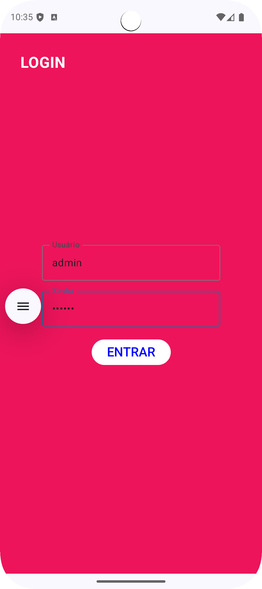
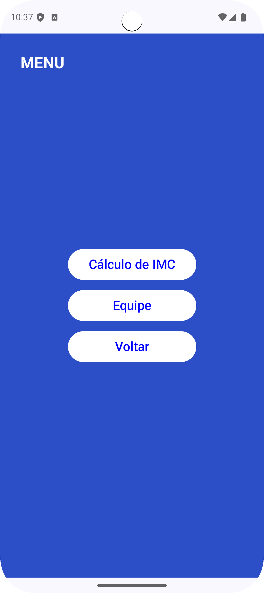
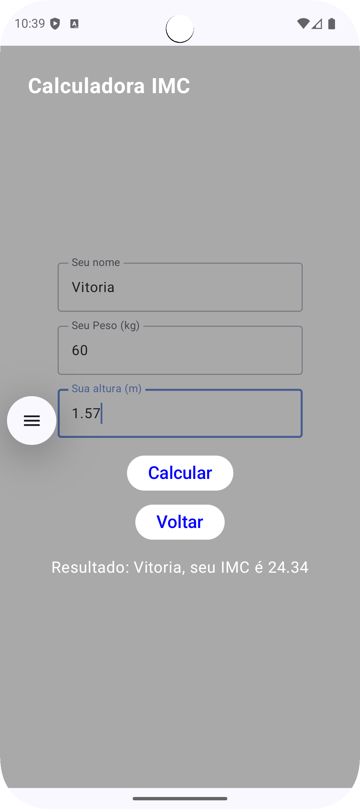
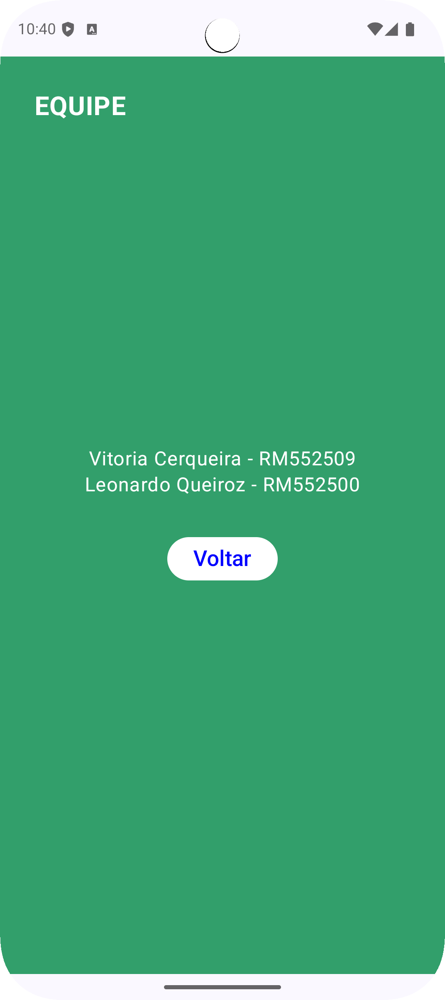

# GS 2 - Android Kotlin Developer (Jetpack Compose)

Este projeto foi desenvolvido como parte da Global Solution (GS 2) da disciplina "Android Kotlin Developer", ministrada pelo Professor Ewerton Carreira.

O objetivo foi criar um aplicativo Android nativo utilizando 100% Jetpack Compose, seguindo um fluxograma de navegação específico que inclui login, menu principal e cálculos de IMC.

---

## Equipe

Insira aqui os nomes e RMs dos integrantes da equipe, conforme solicitado[:

* **Nome:** Vitoria Cerqueira
    * **RM:** 552509
* **Nome:** Leonardo Queiroz
    * **RM:** 552500

---

## Telas do Aplicativo

Abaixo estão as evidências das telas do aplicativo em funcionamento, conforme solicitado.

### 1. Tela de Login
A tela de login valida o usuário (`admin`) e a senha (`123456`).

### 2. Tela de Menu
O menu principal permite a navegação para a calculadora de IMC e para a tela da equipe.

### 3. Tela de Cálculo de IMC
Esta tela calcula o IMC com base no nome, peso e altura (em metros) do usuário.

### 4. Tela de Equipe
Exibe os nomes e RMs dos integrantes do grupo.

---

## Tecnologias Utilizadas

* **Kotlin:** Linguagem de programação principal.
* **Jetpack Compose:** Toolkit de UI declarativo para construção de interfaces nativas.
* **Navigation Compose:** Biblioteca para gerenciamento de navegação entre as telas (Composables).
* **Material 3:** Componentes de design para a interface.

## Link Github
https://github.com/Viihcerq/ImcApp